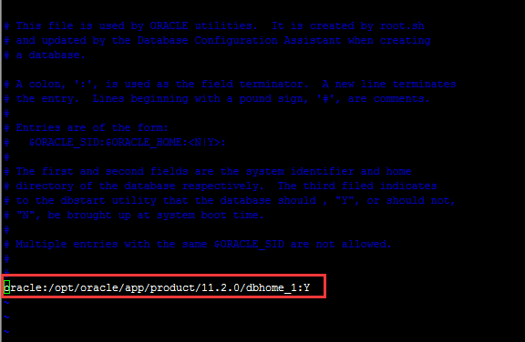
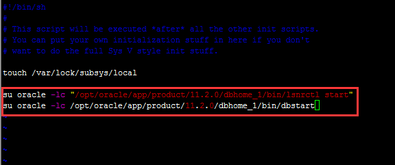



# 本例使用环境
- Linux `RedHat6.5`发行版_64位
- `Oracle11g_R2`_64位
- `Xshell 4`：远程登录主机软件

# 配置步骤

1. 使用root账号登录服务器（可以使用远程登录方法）

2. 更改oratab配置：
先使用vim打开`/etc/oratab`文件
	```shell
	# vim /etc/oratab
	```
	将oracle:/opt/oracle/app/product/11.2.0/dbhome_1:N 改为`oracle:/opt/oracle/app/product/11.2.0/dbhome_1:Y`
	其中：oracle为实例名；/opt/oracle/app/product/11.2.0/dbhome_1为oracle的安装路径，会因安装的情况不同而有所不同。如下图所示：
	

3. 更改启动配置文件`/etc/rc.d/rc.local`文件
	```shell
	# vim /etc/rc.d/rc.local
	```
	添加以下两句：
	```shell
	su oracle -lc "/opt/oracle/app/product/11.2.0/dbhome_1/bin/lsnrctl start"
	su oracle -lc /opt/oracle/app/product/11.2.0/dbhome_1/bin/dbstart
	```
	其中`/opt/oracle/app/product/11.2.0/dbhome_1`为oracle安装目录。如下图所示：
	