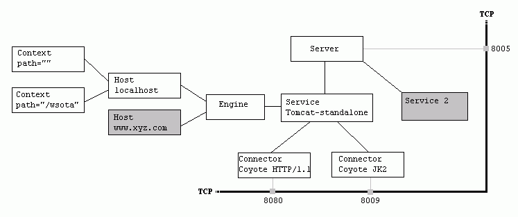



## 问题背景
> 当一个机器中安装多个tomcat并需要同时启动时，会出现端口被占用而无法同时启动的问题

## 问题分析
> 如果都是用的默认的端口，当启动一个tomcat时，就已经占用了默认端口，再启动其他tomcat就无法使用已经被占用的端口。

## 解决方法:修改tomcat端口
本例使用tomcat6.0，其他版本类似。主要需要修改3个端口：

1.修改监听HTTP1.1请求的端口
```xml
<Connector port="8080" protocol="HTTP/1.1" 
               connectionTimeout="20000" 
               redirectPort="8443" 
			   URIEncoding="UTF-8"/>
```
修改其中的`port="8080"`为其他端口，如：`port="8081"`

2.修改监听AJP请求的端口，该端口接收由其他服务器转发过来的请求
```xml
<Connector port="8009" protocol="AJP/1.3" redirectPort="8443" />
```
修改其中的`port="8009"`为其他端口，如：`port="8010"`

3.修改监听tomcat关闭请求的端口
```xml
<Server port="8005" shutdown="SHUTDOWN">
```
修改其中的`port="8005"`为其他端口，如：`port="8006"`

确定修改后的端口没有其他地方使用的，修改以上端口后重启启动tomcat即可
## tomcat server结构图


## 更多阅读
1. [Tomcat Server.xml详解](http://www.cnblogs.com/gugnv/archive/2012/02/01/2334187.html)
2. [当装了两个tomcat后，如何修改tomcat端口](http://blog.csdn.net/alongwilliam/article/details/8199974)

