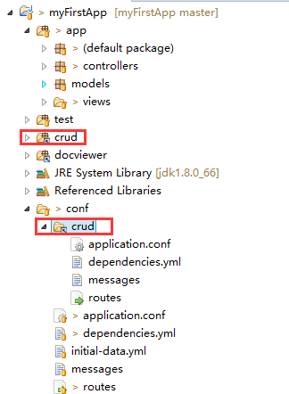



## 问题背景
> 在play中添加模块

## 测试环境
- play framework 1.4.1
- jdk 1.8.0_66
- Eclipse Luna (4.4)

## 添加模块的步骤
在一个已有的应用里面添加模块，这里以添加crud为例：

1.在依赖配置文件中添加crud的依赖
```yml
{app}/conf/dependencies.yml
===========================
require:
    - play 1.4.1
    - play -> crud
```

2.在控制台输入以下命令添加依赖的jar包或文件
```yml
在应用目录下
============
play dependencies 
```

3.重新生成IDE的配置文件，这里是eclipse
```sh
在应用目录下,根据IDE选择其中一个命令
================================
play eclipsify
play netbeansify
play play idealize
```

4.IDE中(eclipse)刷新项目，crud的相关包和配置文件已加入项目  


5.在应用中添加crud模块的route路由
```
{app}/config/routes
===================
# Import CRUD routes
*     	/admin           						module:crud
```


## 更多阅读
1. [Play 框架模块：Divide 和 conquer](http://www.oschina.net/translate/play-framework-modules-divide-and-conquer?cmp&p=1)
2. [Setting up a basic administration area using CRUD](https://www.playframework.com/documentation/1.4.x/guide7)
3. [配置你喜欢的 IDE](http://play-framework.herokuapp.com/zh/ide#h3-2)

